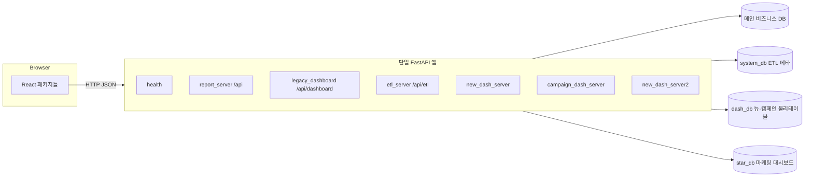

# 시스템 개발 가이드 (AI·온보딩용)

## 문서 정보

| 항목 | 내용 |
|------|------|
| **위치** | `docs/main/03_개발가이드.md` |
| **주 목적** | 저장소 전체 코드를 업로드하지 않고도 **현재 시스템 구조**와 **확장·수정 시 어디를 열어야 하는지**를 파악해, AI 또는 신규 참여자가 정확한 구현 방향을 잡을 수 있게 한다. |
| **와 함께 볼 문서** | **00_PRD.md**(제품·설정 요약), **01_FRONTEND_GUIDE.md**(프론트 경로·패키지), **02_BACKEND_GUIDE.md**(API·모듈 상세). **작업 이력**은 **docs/log/log.md**. **보조 설계·배포**는 **docs/report/**. |
| **갱신 원칙** | 아키텍처(패키지 분리·URL·DB 연결)가 바뀌면 본 문서와 00/01/02 중 해당 절을 함께 맞춘다. 날짜 타임라인은 두지 않는다. |

---

## 1. 한 장 시스템 지도

### 1.1 런타임 한 프로세스

- **백엔드**: `python run.py back` → 단일 FastAPI 앱(`Backend/api_server/main.py`)이 **여러 Python 패키지의 라우터**를 `include_router`로 묶는다. URL prefix(`/api/...`)는 과거와 동일하게 유지하는 것이 원칙이다.
- **프론트**: `Frontend/react-app`(Vite, base `/ibank-bi/`). 빌드 산출물은 정적 서버가 서빙하고, API는 `config.frontend.api_base_url`(또는 주입 `api-config.js`)로 호출한다.

### 1.2 “기능 영역”과 백엔드 패키지 (요약)

| 사용자 facing | HTTP prefix (대표) | Backend 패키지 | 비고 |
|---------------|-------------------|----------------|------|
| 노코드 리포트 | `/api/list-tables`, `execute-query`, … | `Backend/report_server` | 조인·라벨·분석 저장 등 동일 패키지 |
| 구 대시보드 | `/api/dashboard/*` | `Backend/legacy_dashboard_server` | 집계 로직은 **core** |
| ETL | `/api/etl`, `/api/etl/batch` | `Backend/etl_server` | 단일 ETL 스택 |
| 뉴 대시보드 | `/api/new-dashboard/*` | `Backend/new_dash_server` | |
| 캠페인 대시보드 | `/api/campaign-dashboard/*` | `Backend/campaign_dash_server` | Star 물리 테이블 |
| 마케팅 대시보드 | `/api/new-dashboard2/*` | `Backend/new_dash_server2` | **core.db 미사용**, `star_db` 자체 연결 |
| 헬스·루트 | `/health`, `/`, `/api` | `Backend/api_server/routers/health.py` | |

---

## 2. 백엔드 레이어와 의존 방향

### 2.1 호스트: `Backend/api_server`

- **역할**: `FastAPI()` 생성, CORS, `lifespan`(ETL 스케줄러 등), 예외 핸들러, **`include_router` 나열**.
- **로컬 파일**: `main.py`, `routers/__init__.py`(외부 패키지 라우터 재export), `routers/health.py`.
- **비즈니스 로직·DB 모듈을 여기 두지 않는다.** (리팩터링 후 구조.)

### 2.2 공유 코어: `Backend/core`

| 모듈 | 역할 | 다른 패키지가 쓰는 방식 |
|------|------|-------------------------|
| `db.py` | 메인·시스템·dash_db 연결 풀, 테이블/컬럼 검증, `allowed_tables` | `report_server`, `etl_server`, `new_dash_server`, `campaign_dash_server`, `dependencies`, `dashboard_service`, 스크립트 |
| `dependencies.py` | FastAPI `get_db`, `get_config` | `report_server/router`, `api_server/routers/health` |
| `dashboard_service.py` | 캠페인/일자/워크플로우/채널 집계·차트·필터 | `legacy_dashboard_server`, `new_dash_server`, `campaign_dash_server` |

**의존 규칙 (중요)**:

- `core`는 **`report_server` / `legacy_dashboard_server` / 라우터 패키지를 import하지 않는다.** (순환 방지.)
- `report_server` → `core`만 바라본다.

각 파일 상단 docstring에 **`[Package Usage]`**(어느 패키지가 어떤 함수를 쓰는지)가 번호 맞춰 적혀 있으므로, 세부 호출 관계는 코드를 열기 전에 그 블록을 보면 된다.

### 2.3 리포트: `Backend/report_server`

- **`router.py`**: `/api` prefix 전역. `Env/config/column_labels.json` 경로는 `router.py` 기준 프로젝트 루트 계산(3단 `parent`)으로 잡힌다.
- **스키마**: `schemas.py`(리포트용 Pydantic만).
- **전용 유틸**: `join_path`, `join_metrics`, `relationship_inference`, `pluralize`, `analysis_store`.

### 2.4 구 대시보드: `Backend/legacy_dashboard_server`

- **`router.py`**: `/api/dashboard`.
- **`schemas.py`**: `DashboardDataRequest`, `ChartDataRequest` 등 구 대시보드 POST 바디만.

### 2.5 ETL·대시보드 전용 패키지

- **`etl_server`**: 메타·적재·배치·워커. `core.db`로 시스템 DB·메인 DB 접근.
- **`new_dash_server` / `campaign_dash_server`**: `core.dashboard_service` + `core.db`(dash 분기).
- **`new_dash_server2`**: `config.backend.star_db` 전용 모듈(`star_db.py`). **의도적으로 `Backend.core.db`를 쓰지 않는다.**

---

## 3. DB·설정 매트릭스 (코드 탐색용)

| 설정 키(개념) | 용도 | 주로 쓰는 모듈 |
|---------------|------|----------------|
| `config.backend` (db_*) | 메인 비즈니스 DB, `allowed_tables`, `table_schema` | `core.db`, 리포트·구대시·ETL |
| `config.backend.system_db` | ETL 메타·Job 등 | `core.db.get_db_connection_system`, `etl_server` |
| `config.backend.dash_db` | `ibank_1` 계열·Star 물리 테이블 | `core.db.get_db_connection_dash` 등, 대시보드 서비스/라우터 |
| `config.backend.star_db` | 마케팅 대시보드 전용 | `new_dash_server2/star_db.py`만 |

설정 파일은 **`Env/config/config.json`만** 쓴다 (.env 없음).

---

## 4. 프론트엔드 ↔ API 매핑

- **라우트·네비**: `Frontend/react-app/src/app/routes.jsx`, `navConfig.js`.
- **패키지별 API 클라이언트**: `packages/<도메인>/api/*Client.js` + `shared/api/http.js` + `shared/config/api.js`.
- **CSS**: 패키지별 전용 파일만 사용(패키지 간 공유 금지) — **01_FRONTEND_GUIDE §6**.

| 화면(대표) | 프론트 패키지 | API 베이스 경로(대표) |
|------------|---------------|------------------------|
| 리포트 | `packages/query_studio` | `/api/...` |
| 대시보드1 | `packages/dashboard` | `/api/dashboard/...` |
| 뉴 대시보드 | `packages/new-dashboard` | `/api/new-dashboard/...` |
| 캠페인 대시보드 | `packages/campaign_dashboard` | `/api/campaign-dashboard/...` |
| 마케팅 대시보드 | `packages/new-dashboard2` | `/api/new-dashboard2/...` |
| ETL | `packages/etl` (및 etl2 관련) | `/api/etl/...`, `/api/etl/batch/...` |

ETL2·저장 DB UI 규칙(기본 DB `null`, FormData vs JSON)은 **`.cursor/rules/project-conventions.mdc`** 및 **packages/etl2** 쪽 주석을 본다.

---

## 5. 작업 유형별 “먼저 열 파일” 체크리스트

### 5.1 리포트(노코드) API 추가/변경

1. `Backend/report_server/router.py` (또는 분리 시 동일 패키지 내 라우터).
2. 요청 바디가 필요하면 `Backend/report_server/schemas.py`.
3. 프론트: `packages/query_studio/api/queryStudioClient.js` 및 호출 컴포넌트.
4. 검증: `.cursor/skills/api-client-sync/SKILL.md`, `cross-check/SKILL.md` 절차.

### 5.2 구 대시보드 API만 변경

1. `Backend/legacy_dashboard_server/router.py`, `schemas.py`.
2. 집계 로직 변경이면 **`Backend/core/dashboard_service.py`** (뉴/캠페인과 공유되는지 확인).

### 5.3 뉴·캠페인 대시보드 API/집계 변경

1. 라우터: `new_dash_server/router.py` 또는 `campaign_dash_server/router.py`.
2. 공통 집계·KPI: `core/dashboard_service.py`.
3. 테이블/연결 규칙: `core/db.py`의 dash 분기·`is_new_dash_physical_table` 등.

### 5.4 마케팅 대시보드(new-dashboard2)

1. `Backend/new_dash_server2/router.py`, `service.py`, `star_db.py`.
2. **`core.db`를 import하지 않는지** 유지(기존 설계).

### 5.5 ETL 동작·적재·배치

1. `Backend/etl_server/` — **02_BACKEND_GUIDE §6**, **docs/report/08_ETL_Phase_Implement_Guide.md**.
2. DB 스키마 변경 시 마이그레이션·Pydantic·client·UI 연쇄는 **migration-helper 스킬** 참고.

### 5.6 공통 DB 연결·허용 테이블·풀 동작 변경

1. `Backend/core/db.py` 단일 진입으로 모은다.
2. 영향 범위: `db.py`의 `[Package Usage]` 1~22번 목록을 본다.

### 5.7 신규 React 페이지(신규 메뉴)

1. `routes.jsx`, `navConfig.js`.
2. `packages/<새 도메인>/` (페이지, `api/*Client.js`, 전용 CSS).
3. 백엔드 라우터를 새로 만들 경우 `api_server/main.py`에 `include_router` 추가.

---

## 6. 품질·검증·자동화 힌트

- **백엔드 import**: `python -m compileall Backend/core Backend/report_server …` 또는 프로젝트 `.venv`로 `from Backend.api_server.main import app`.
- **API-프론트 정합성**: 스킬 **cross-check**, **api-client-sync**.
- **테스트**: `tests/test_join_path.py`, `test_table_relationship_inference.py` 등은 `Backend.report_server` 유틸을 import한다.
- **Git 커밋 메시지**: 사용자 규칙에 따라 영문 접두사(`feat`/`fix`/`refactor`) 등.

---

## 7. docs/main vs docs/report

| 폴더 | 용도 |
|------|------|
| **docs/main** | **현재 동작·구조의 기준** (PRD, FE/BE 가이드, 본 AI용 가이드). |
| **docs/report** | 설계 초안, ETL 상세, 배포 문서, 인덱스 등. 구현과 불일치할 수 있으므로 충돌 시 **코드 + docs/main**을 우선한다. |

---

## 8. Cursor 규칙·스킬 (요약)

- **프로젝트 규칙**: `.cursor/rules/` — 설정(`config.json`), ETL2 저장 DB 표기, 패키지별 CSS, 파일 상단 한글 docstring 형식 등.
- **스킬**: `.cursor/skills/` — 엔드포인트 추가, 클라이언트 동기화, DB 적재, React 컴포넌트, 에러 진단 등 작업 유형별 절차.

---

## 9. 문서 세트 역할 정리

| 문서 | 이 가이드와의 관계 |
|------|-------------------|
| **00_PRD** | 무엇을 하는 제품인지, 어떤 화면·기능이 있는지 한 번에. |
| **01_FRONTEND** | 폴더 트리, 컴포넌트·라우트·스타일 상세. |
| **02_BACKEND** | 엔드포인트 표, etl_server 장문 설명, 설정 절. |
| **03 (본 문서)** | 위 세 문서를 **연결하는 지도** + 의존 방향 + “어디를 고칠지” 빠른 결정. |

질문 예: *“캠페인 대시보드에 새 지표 API를 추가하려면?”* → **§1 표**에서 `campaign_dash_server` + **§5.3** → 집계가 기존과 같으면 `dashboard_service`까지 볼지 판단 → **02 §4.6.2**로 엔드포인트 네이밍 패턴 확인 → **01**에서 `campaign_dashboard` 클라이언트 경로 확인.
