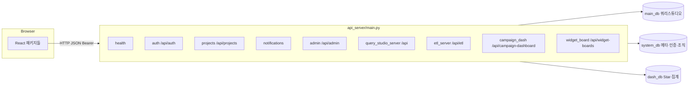
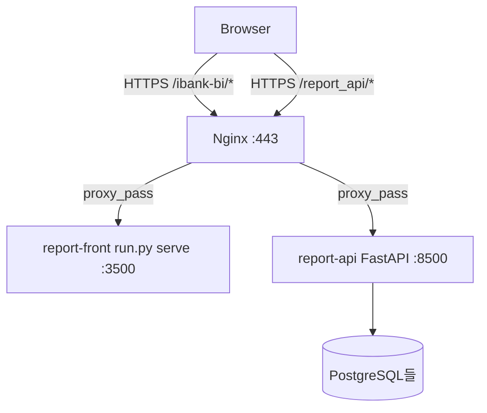

# 시스템 개발 가이드 (AI·온보딩용)

## 문서 정보

| 항목 | 내용 |
|------|------|
| **위치** | `docs/report/03_AI_DEVELOP_GUIDE.md` |
| **주 목적** | 저장소 전체 코드를 업로드하지 않고도 **현재 시스템 구조**와 **확장·수정 시 어디를 열어야 하는지**를 파악해, AI 또는 신규 참여자가 정확한 구현 방향을 잡을 수 있게 한다. |
| **와 함께 볼 문서** | **00_PRD.md**, **01_FRONTEND_GUIDE.md**, **02_BACKEND_GUIDE.md**, **04_DB_ARCHITECTURE.md**, **05_Permission_ARCHITECTURE.md**(권한·역할·`require_permission`), **06_CUSTOMER_JOURNEY.md**(고객 여정). **작업 이력**: **docs/log/log.md**. **보조 설계**: **docs/report/**. |
| **갱신 원칙** | 아키텍처(패키지 분리·URL·DB 연결)가 바뀌면 본 문서와 00/01/02 중 해당 절을 함께 맞춘다. 날짜 타임라인은 두지 않는다. |

---

## 1. 한 장 시스템 지도

### 1.1 런타임 한 프로세스

- **백엔드**: `python run.py back` → 단일 FastAPI 앱(`Backend/api_server/main.py`)이 **여러 Python 패키지의 라우터**를 `include_router`로 묶는다. URL prefix(`/api/...`)는 과거와 동일하게 유지하는 것이 원칙이다.
- **프론트**: `Frontend/react-app`(Vite, base `/ibank-bi/`). 빌드 산출물은 정적 서버가 서빙하고, API는 `config.frontend.api_base_url`(또는 주입 `api-config.js`)로 호출한다.



### 1.2 “기능 영역”과 백엔드 패키지 (요약)

| 사용자 facing | HTTP prefix (대표) | Backend 패키지 | 비고 |
|---------------|-------------------|----------------|------|
| 인증·세션·/me | `/api/auth/*` | `Backend/auth_server` | JWT·2FA·초대 가입 |
| 프로젝트 선택 | `/api/projects` | `Backend/project_server` | access 토큰에 `project_info_id` |
| 알림 | `/api/notifications` | `Backend/notification_server` | |
| 어드민(부서·사용자·권한·프로젝트) | `/api/admin/*` | `Backend/admin_server` | 조직 역할·트리 정책 |
| 쿼리 스튜디오 | `/api/list-tables`, `execute-query`, … | `Backend/query_studio_server` | `Depends(require_permission(...))` |
| ETL | `/api/etl`, `/api/etl/batch` | `Backend/etl_server` | 앱 레벨 `require_etl_infrastructure` |
| 캠페인 대시보드 | `/api/campaign-dashboard/*` | `Backend/campaign_dash_server` | `require_permission("dashboard")`, dash_db Star |
| 위젯 보드 | `/api/widget-boards/*` | `Backend/widget_board_server` | `require_permission("widgetboard")` |
| 헬스·루트 | `/health`, `/`, `/api` | `Backend/api_server/routers/health.py` | |

---

## 2. 백엔드 레이어와 의존 방향

### 2.1 호스트: `Backend/api_server`

- **역할**: `FastAPI()` 생성, CORS, `lifespan`(ETL 스케줄러 등), 예외 핸들러, **`include_router` 나열**.
- **로컬 파일**: `main.py`, `routers/__init__.py`(외부 패키지 라우터 재export), `routers/health.py`.
- **비즈니스 로직·DB 모듈을 여기 두지 않는다.** (리팩터링 후 구조.)

### 2.2 공유 코어: `Backend/core`

| 모듈 | 역할 | 다른 패키지가 쓰는 방식 |
|------|------|-------------------------|
| `db.py` | 메인·시스템·dash_db 연결 풀, `get_allowed_tables`(JWT `project_info_id` 있으면 `table_project_mapping`·`table_master` 기반, 없으면 메인 스키마 전체 목록 호환), 테이블/컬럼 검증 | `query_studio_server`, `etl_server`, `campaign_dash_server`, `auth_server`, `admin_server`, `dependencies`, `dashboard_service`, 스크립트 |
| `dependencies.py` | FastAPI `get_db`, `get_config` | `query_studio_server/router`, `api_server/routers/health` |
| `auth_config.py` | JWT·SMTP·`get_app_url` | `auth_server`, `Backend.mail` |
| `logging_setup.py` | 루트 로깅 포맷 구성 | `api_server/main`(기동 시) |
| `dashboard_service.py` | 캠페인/일자/워크플로우/채널 집계·차트·필터 | `campaign_dash_server` |

**의존 규칙 (중요)**:

- `core`는 **`query_studio_server` / 라우터 패키지를 import하지 않는다.** (순환 방지.)
- `query_studio_server` → `core`만 바라본다.

각 파일 상단 docstring에 **`[Package Usage]`**(어느 패키지가 어떤 함수를 쓰는지)가 번호 맞춰 적혀 있으므로, 세부 호출 관계는 코드를 열기 전에 그 블록을 보면 된다.

### 2.3 쿼리 스튜디오: `Backend/query_studio_server`

- **`router.py`**: `/api` prefix 전역. `Env/config/column_labels.json` 경로는 `router.py` 기준 프로젝트 루트 계산(3단 `parent`)으로 잡힌다.
- **스키마**: `schemas.py`(쿼리 스튜디오용 Pydantic만).
- **전용 유틸**: `join_path`, `join_metrics`, `relationship_inference`, `pluralize`, `peak_guard`(`config.backend.query_studio_peak_guard` 선택).

### 2.4 ETL·대시보드·위젯 보드 전용 패키지

- **`etl_server`**: 메타·적재·배치·워커. `core.db`로 시스템 DB·메인 DB 접근.
- **`campaign_dash_server`**: `/api/campaign-dashboard`. `core.dashboard_service` + `core.db`(dash 분기).
- **`widget_board_server`**: `/api/widget-boards`. system_db 메타·메인 DB 조회.

---

## 3. DB·설정 매트릭스 (코드 탐색용)

| 설정 키(개념) | 용도 | 주로 쓰는 모듈 |
|---------------|------|----------------|
| `config.backend.main_db` | 메인 비즈니스 DB(`db_*`, `table_schema`) — **필수 블록** | `core.db`, 쿼리 스튜디오·ETL |
| `config.backend.system_db` | ETL 메타·Job 등 | `core.db.get_db_connection_system`, `etl_server` |
| `config.backend.dash_db` | `ibank_1` 계열·Star 물리 테이블 | `core.db.get_db_connection_dash` 등, 대시보드 서비스/라우터 |

설정 파일은 **`Env/config/config.json`만** 쓴다 (.env 없음).

---

## 4. 프론트엔드 ↔ API 매핑

- **라우트·네비**: `Frontend/react-app/src/app/routes.jsx`, `app/layout/navConfig.js`.
- **패키지별 API 클라이언트**: `packages/<도메인>/api/*Client.js` + `shared/api/http.js` + `shared/config/api.js`.
- **CSS**: 패키지별 전용 파일만 사용(패키지 간 공유 금지) — **01_FRONTEND_GUIDE §6**.

| 화면(대표) | 프론트 패키지 | API 베이스 경로(대표) |
|------------|---------------|------------------------|
| 쿼리 스튜디오 | `packages/query_studio` | `/api/...` (`require_permission`) |
| 대시보드(캠페인) | `packages/campaign_dashboard` | `/api/campaign-dashboard/...` |
| 위젯보드 | `packages/widgetboard` | 쿼리 스튜디오 `/api/execute-query` 등 |
| ETL | `packages/etl` | `/api/etl/...`, `/api/etl/batch/...` (`require_etl_infrastructure`). 클라이언트 함수명은 역사적 이유로 `etl2*` 접두를 유지할 수 있음(`etlClient.js`). |
| 어드민 SPA | `src/app/admin/*` + `shared/api/adminClient.js` | `/api/admin/...` |

저장 DB UI 규칙(기본 DB `null`, FormData vs JSON)은 **`.cursor/rules/project-conventions.mdc`** 및 **`packages/etl/utils/storageDb.js`** 를 본다.

---

## 5. 작업 유형별 “먼저 열 파일” 체크리스트

### 5.1 쿼리 스튜디오 API 추가/변경

1. `Backend/query_studio_server/router.py` (또는 분리 시 동일 패키지 내 라우터).
2. 요청 바디가 필요하면 `Backend/query_studio_server/schemas.py`.
3. 프론트: `packages/query_studio/api/queryStudioClient.js` 및 호출 컴포넌트.
4. 검증: `.cursor/skills/api-client-sync/SKILL.md`, `cross-check/SKILL.md` 절차.

### 5.2 캠페인 대시보드 API/집계 변경

1. 라우터: `Backend/campaign_dash_server/router.py`.
2. 공통 집계·KPI: `core/dashboard_service.py`.
3. 테이블/연결 규칙: `core/db.py`의 dash 분기·`is_new_dash_physical_table` 등.

### 5.3 ETL 동작·적재·배치

1. `Backend/etl_server/` — **02_BACKEND_GUIDE §6**, **docs/report/08_ETL_Phase_Implement_Guide.md**.
2. DB 스키마 변경 시 마이그레이션·Pydantic·client·UI 연쇄는 **migration-helper 스킬** 참고.

### 5.4 공통 DB 연결·허용 테이블·풀 동작 변경

1. `Backend/core/db.py` 단일 진입으로 모은다.
2. 영향 범위: `db.py`의 `[Package Usage]` 1~22번 목록을 본다.

### 5.5 신규 React 페이지(신규 메뉴)

1. `app/routes.jsx`, `app/layout/navConfig.js`.
2. `packages/<새 도메인>/` (페이지, `api/*Client.js`, 전용 CSS).
3. 백엔드 라우터를 새로 만들 경우 `api_server/main.py`에 `include_router` 추가.

---

## 6. 품질·검증·자동화 힌트

- **백엔드 import**: `python -m compileall Backend/core Backend/query_studio_server …` 또는 프로젝트 `.venv`로 `from Backend.api_server.main import app`.
- **API-프론트 정합성**: 스킬 **cross-check**, **api-client-sync**.
- **테스트 명령**: **§15** 참고.
- **Git 커밋 메시지**: 사용자 규칙에 따라 영문 접두사(`feat`/`fix`/`refactor`) 등.

---

## 7. docs/main vs docs/report

| 폴더 | 용도 |
|------|------|
| **docs/main** | **현재 동작·구조의 기준** (PRD, FE/BE 가이드, 본 AI용 가이드). |
| **docs/report** | 설계 초안, ETL 상세, 배포 문서, 인덱스 등. 구현과 불일치할 수 있으므로 충돌 시 **코드 + docs/main**을 우선한다. |

---

## 8. Cursor 규칙·스킬 (요약)

- **프로젝트 규칙**: `.cursor/rules/` — 설정(`config.json`), ETL 저장 DB 표기, 패키지별 CSS, 파일 상단 한글 docstring 형식 등.
- **스킬**: `.cursor/skills/` — 엔드포인트 추가, 클라이언트 동기화, DB 적재, React 컴포넌트, 에러 진단 등 작업 유형별 절차.

---

## 9. 인증·인가 (현행 구현)

- **애플리케이션 레벨**: **`/api/auth/*`** — 로그인(1·2단계)·리프레시·세션(`session_log`)·access JWT(`Backend.auth_server.security`, `deps.require_active_access` / 로그아웃만 `require_access_session_bound`). 프론트는 `shared/api/http.js` 가 `Authorization: Bearer`·401 시 refresh 1회 재시도.
- **프로젝트·권한**: 쿼리 스튜디오·캠페인 대시보드 등은 **`require_permission(*ids)`** — JWT `project_info_id`·`project_ptcpnt_info`·`pmssn_master.pmssn_list`(상세명 정규화). **ETL** 전역은 **`require_etl_infrastructure`** (`sa_dev` 또는 `etl_yn=Y`, 레거시 `user_dvsn=etl_manager` 예외). 조직 역할 캐논은 **`Backend.core.user_dvsn_codes`**. 표·흐름도는 **05_Permission_ARCHITECTURE.md**.
- **운영**: TLS·Nginx 프록시·IP 제한은 **docs/report/DEPLOY_SERVER.md** 등과 병행 가능. 앱 인증이 이미 있으므로 “인증 없는 공개 API” 전제는 **레거시 문서 구절과 혼동하지 말 것**.

---

## 10. HTTP 에러 응답·프론트 파싱

### 10.1 앱 전역 예외 (api_server/main.py)

- **404**: `{"error": "<한글 고정 문구>", "message": "<예외 문자열>"}`  
- **500**: `{"error": "서버 내부 오류", "message": "<예외 문자열>"}`  
- **공통 필드 `code`는 없다** (HTTP 상태 코드가 유일한 기계 판별 값).

### 10.2 라우트별 비즈니스 오류 (관례)

- 다수 엔드포인트는 `JSONResponse(status_code=4xx/5xx, content={"error": "사유 문자열"})` 형태. 일부는 `message`를 추가로 넣기도 한다.
- **FastAPI / Pydantic 검증 실패**: 표준 **`detail`** 필드(문자열 또는 배열). 프론트 **`shared/api/http.js`** 의 `formatFetchErrorMessage`가 `detail`(배열이면 `msg`·`loc` 조합) → 없으면 `error` → 없으면 `message` 순으로 메시지를 고른다.

```text
우선순위(프론트): detail → error → message → "HTTP {status}"
```

- **신규 API 추가 시**: 가능하면 **`error` 문자열**을 일관되게 두고, 프론트는 `request()` 경로를 쓰면 위 파싱을 그대로 활용한다.

---

## 11. 메인 비즈니스 DB·쿼리 스튜디오 노출 테이블

- **쿼리 스튜디오(`list-tables` 등)** 는 JWT의 **`project_info_id`** 로 `Backend.core.db.get_allowed_tables(project_info_id, …)` 를 호출해, **system_db** 의 `table_project_mapping` + `table_master` 에 매핑된 테이블만 노출한다. 프로젝트 미선택·매핑 없으면 빈 목록이 될 수 있다. (구 `config.allowed_tables` 화이트리스트 파일 방식은 제거됨.)
- **샘플(`Env/config/config.json.example`)** 에 포함된 이름 예시(의미는 도메인 설명용이며, FK는 실제 DB 제약을 **코드·DB**에서 확인할 것):

| 테이블(예시) | 역할(개념) | 쿼리 스튜디오/JOIN에서의 위치 |
|--------------|------------|-------------------------|
| `campaign_integrated_master` | 캠페인 통합 마스터 | 허용 테이블 집합의 축이 될 수 있음 |
| `campaign_member_segment` | 캠페인·회원 세그먼트 | 세그먼트·타깃 분석 |
| `campaign_metadata` | 캠페인 메타 | 캠페인 속성·기간 등 |
| `campaign_offer_log` | 오퍼/캠페인 로그 이력 | 발송·응답 이벤트 성격 |

- **관계 추론**: `query_studio_server`의 FK 조회 + `relationship_inference`·`join_path`가 **information_schema·테이블명 규칙**을 바탕으로 동작한다. ER을 문서에 전부 적지 않아도, **“허용 테이블 = 쿼리 스튜디오 UI에 올라올 수 있는 팩트/차원”** 이라고 이해하면 된다.
- **상세 스키마**: 운영 DB에서 직접 `information_schema` 또는 **쿼리 스튜디오 UI describe-table**로 확인하는 것이 정확하다.

---

## 12. dash_db 물리 테이블·핵심 컬럼 요약

**DB**: `config.backend.dash_db` (`main_db.db_name` 과 별도). **테이블 이름 패턴**은 `core/db.py` 의 `is_new_dash_physical_table` 과 일치한다.

### 12.1 집계·구/뉴/캠페인 공통 (`dashboard_service`)

`Backend/core/dashboard_service.py` 의 **`DASHBOARD_REQUIRED_COLUMNS`** 에 정의된 컬럼이 **구 대시보드용 집계 테이블**에 필요하다(타입은 PostgreSQL `information_schema` 기준 문자열과 매칭).

| 컬럼명 | 용도(개념) |
|--------|------------|
| `delivery_date` | 일자 축 |
| `campaign_id` / `campaign_label` | 캠페인 차원 |
| `workflow_id` / `workflow_label` | 워크플로 차원 |
| `delivery_channel` | 채널 코드 |
| `total_count` / `success_count` / `failed_count` / `open_count` / `click_count` | 발송·성과 지표 |

- **물리 테이블 예**: `ibank_1`(집계 본表), `ibank_1_0`~`ibank_1_4`(서브). **캠페인 대시보드**는 Star 계열 `ibank_*_star_1`(발송 팩트), `ibank_*_star_2`(회원 스냅샷, **JSONB** 컬럼 포함)를 사용한다(상세 키·JSON 스키마는 **docs/report/16_Campaign_Dashboard_Star_Schema_Plan.md** 및 실 DB 참고).

### 12.2 뉴/캠페인 `member-summary` (스냅샷)

- **주 테이블**: 보통 `ibank_1_0` (서브 `…_0`). **날짜 컬럼**: `_0`만 **`base_date`**, 그 외 서브는 **`delivery_date`** (`campaign_dash_server/router.py` 주석 참고).
- **API에서 읽는 대표 컬럼**(행은 `base_date` 최신 1건 스냅샷 등으로 선택):

| 컬럼명 | 용도 |
|--------|------|
| `base_date` | 스냅샷 일자(회원 일별 집계) |
| `total_recipients` | 총 회원수(잔액형 지표, 기간 끝점 비교에 사용) |
| `increased_count` / `decreased_count` | 유입·이탈 건수(당일 행 기준 참고) |
| `target_recipients` | 발송 대상 모수(동일 스냅샷 로직) |
| 분포 관련 | 성별·나이·등급·opt_in 등 — **base 행의 컬럼을 그대로 노출**(증감 비교 없음) |

- **계산 원칙**(끝점 빼기 등): **02_BACKEND_GUIDE.md §4.6.1** 과 동일.

---

## 13. 배포 네트워크 토폴로지 (Linux·Nginx 예시)

실제 포트·경로는 **`Env/config/config.json`** 과 **systemd 유닛**이 우선이다. 아래는 **docs/report/DEPLOY_SERVER.md** 에 나온 전형적 패턴이다.

| 구성 요소 | 포트(예) | 비고 |
|-----------|----------|------|
| **report-front** (정적) | **3500** | `python run.py serve` — 빌드는 배포 시에만 (`deploy.sh`가 `npm run build` 후 재시작) |
| **report-api** (FastAPI) | **8500** | `uvicorn` / `run.py back` 에 해당 |
| **Nginx** | 443 | TLS 종료·`location /ibank-bi/` → 3500, `location /report_api/` → 8500 등 |
| **브라우저** | — | `api_base_url` 은 **API 프록시 경로**(예: `https://도메인/report_api`) — 프론트 HTML 경로와 혼동 금지 |



- **SSL 인증서 경로**: 리포지토리에 고정 경로 없음 — 서버 Nginx `ssl_certificate` 설정 따름.
- **상세·트러블슈팅**: **docs/report/DEPLOY_SERVER.md**, **docs/report/nginx_report.conf**.

---

## 14. 로깅·모니터링 (현행)

- **백엔드**: `python run.py` / uvicorn이 **콘솔(표준 출력)에 로그**를 남기는 형태가 기본. `main.py` 의 `__main__` 블록에서 `logging.basicConfig`(INFO, 시각·레벨·이름 포맷)를 설정한다. **구조화 JSON 로그·중앙 집계(ELK 등)·요청 ID 미들웨어는 없다.**
- **ETL**: Job·적재 시작/완료/실패는 **터미널·DB 메타(`etl_jobs` 등)** 로 확인하는 패턴이 문서화되어 있다(**02 §6.4**).
- **헬스**: `GET /health` — DB `SELECT 1` 포함 여부로 **프로세스+메인 DB 연결**을 가볍게 확인.
- **알림·SLO·APM**: 코드베이스에 **내장 알림·상용 APM 연동은 없다.** 운영 시 systemd `OnFailure`, 외부 헬스체크가 **구현 필요** 영역이다.

---

## 15. 테스트 실행

| 영역 | 명령 | 비고 |
|------|------|------|
| **프론트 단위** | `cd Frontend/react-app && npm test` | **Vitest** (`vitest run`). `packages/query_studio` `__tests__` 등 |
| **백엔드** | 프로젝트 루트에서 `pytest tests/` | `pytest` 설치 필요. `tests/test_join_path.py`, `test_table_relationship_inference.py`, `test_query_studio_api.py` 등 |
| **린트(프론트)** | `cd Frontend/react-app && npm run lint` | ESLint |

- **CI**: 저장소에 **GitHub Actions 등 파이프라인 설정이 없다**(로컬·수동 실행 기준).

---

## 16. 문서 세트 역할 정리

| 문서 | 이 가이드와의 관계 |
|------|-------------------|
| **00_PRD** | 무엇을 하는 제품인지, 어떤 화면·기능이 있는지 한 번에. |
| **01_FRONTEND** | 폴더 트리, 컴포넌트·라우트·스타일 상세. |
| **02_BACKEND** | 엔드포인트 표, etl_server 장문 설명, 설정 절. |
| **03 (본 문서)** | 위 세 문서를 **연결하는 지도** + 의존 방향 + “어디를 고칠지” + **인증·에러·데이터 요약·배포·로그·테스트**. |

질문 예: *“캠페인 대시보드에 새 지표 API를 추가하려면?”* → **§1.2 표**에서 `campaign_dash_server` + **§5.3** → 집계가 기존과 같으면 `dashboard_service`까지 볼지 판단 → **02 §4.6.2**로 엔드포인트 네이밍 패턴 확인 → **01**에서 `packages/campaign_dashboard` 클라이언트 경로 확인.
