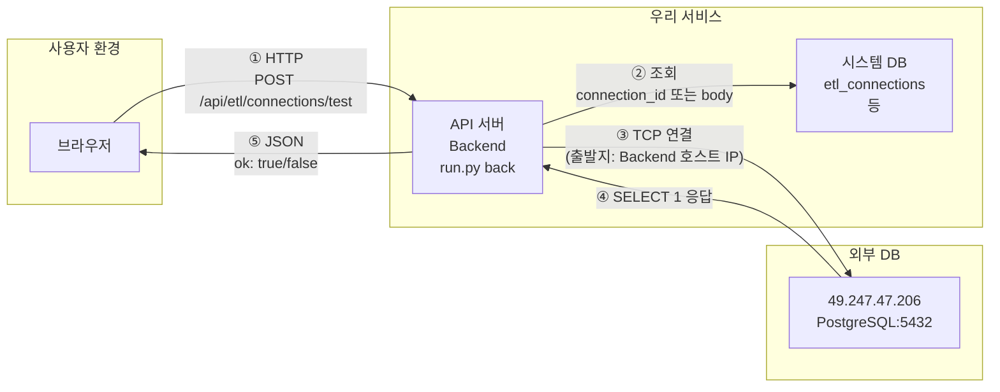
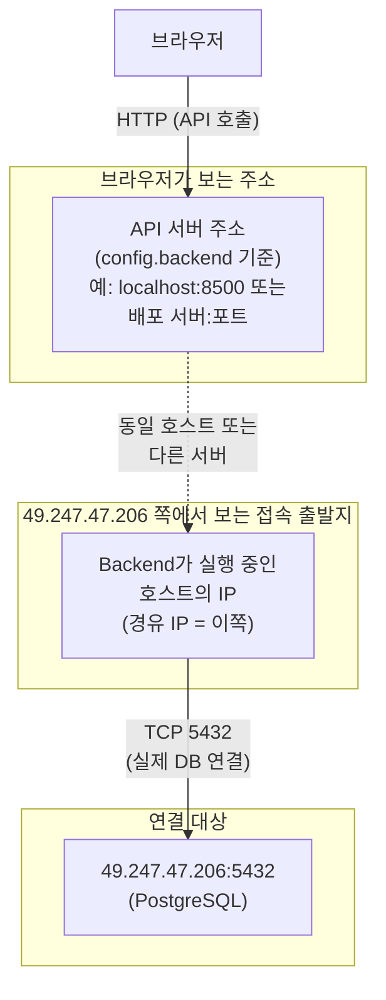

# ETL DB 연결 구조 및 실패 지점

**목적**: ETL에서 외부 DB(예: 49.247.47.206) 연결 테스트 시 **어디서 어떻게 fail이 발생하는지**, **경유하는 IP/구조**를 정리.  
**대상**: 연결 테스트(POST /api/etl/connections/test), 소스 테이블 목록, DB 적재 시 외부 PostgreSQL 접속.

---

## 1. 연결 구조 요약

- **브라우저는 49.247.47.206에 직접 연결하지 않습니다.**
- 브라우저 → (HTTP) → **우리 API 서버(Backend)** → (TCP) → **49.247.47.206:5432(PostgreSQL)**  
- **49.247.47.206 쪽에 “접속 시도”로 보이는 출발지 IP**는 **Backend가 실행 중인 호스트의 IP**입니다.  
  (로컬에서 `python run.py back` 이면 그 PC의 공인/사설 IP, 다른 서버에서 Backend를 돌리면 그 서버의 IP.)

---

## 2. 전체 흐름 모식도



**단계별 설명**

| 단계 | 구간 | 설명 | 실패 시 |
|------|------|------|--------|
| ① | 브라우저 → API 서버 | HTTP로 `POST /api/etl/connections/test` (body에 host, port, database_name, username, password 또는 connection_id) | CORS/네트워크/API 서버 다운 시 브라우저에서 에러 또는 타임아웃 |
| ② | API 서버 → 시스템 DB | connection_id 사용 시 `etl_connections`에서 host/port/database_name/username/encrypted_password 조회 | 연결 없음 → "연결을 찾을 수 없습니다." |
| ③ | **API 서버 → 49.247.47.206:5432** | **Backend 프로세스가 psycopg2.connect(host=49.247.47.206, port=5432, ...) 호출. 이때 TCP 연결의 출발지 = Backend가 돌아가는 호스트의 IP** | 여기서 대부분의 fail 발생 (아래 §4) |
| ④ | 49.247.47.206 → API 서버 | PostgreSQL이 `SELECT 1` 응답 | (드물게) DB 내부 오류 |
| ⑤ | API 서버 → 브라우저 | `{ ok: true/false, message, hint }` JSON 반환 | - |

---

## 3. 경유 IP 정리 (누가 어디로 연결하는가)



- **경유하는 IP**: **없는 것이 아니라 “출발지 IP”가 하나 있습니다.**  
  - **49.247.47.206의 PostgreSQL(또는 방화벽) 로그에 찍히는 “연결 시도한 클라이언트 IP”** = **Backend가 실행 중인 머신의 IP**입니다.  
  - 로컬 PC에서 `python run.py back` → 그 PC의 공인 IP(또는 사설 IP).  
  - AWS/회사 서버에서 Backend 실행 → 그 서버의 IP.  
- 브라우저는 49.247.47.206과 직접 통신하지 않으므로, **DB 서버 입장에서는 “경유 IP”는 곧 “Backend 호스트 IP” 한 개**로 보면 됩니다.

---

## 4. Fail이 발생하는 위치 (코드 기준)

| 순서 | 위치 (파일·함수) | 실패 유형 | 사용자에게 보이는 메시지 예 |
|------|------------------|-----------|-----------------------------|
| 1 | **router.py** `POST /connections/test` | 요청 파싱 실패, 500 | HTTP 500, detail 문자열 |
| 2 | **service.py** `test_connection()` | `connection_id`로 조회 시 연결 없음 | `{ ok: false, message: "연결을 찾을 수 없습니다." }` |
| 3 | **service.py** `test_connection()` | host/database_name/username 누락 | `{ ok: false, message: "host, database_name, username가 필요합니다." }` |
| 4 | **service.py** `_connect_postgres()` | **TCP/인증 실패 (가장 많음)** | 아래 표 참고 |
| 5 | **service.py** `test_connection()` | `SELECT 1` 실행 예외 | `{ ok: false, message, hint }` (_connection_error_to_user_message 변환) |

**4번 `_connect_postgres()` 실패 시 예외별 메시지 (service.py `_connection_error_to_user_message`)**  
→ 여기서 **fail로 떨어지는 구체적인 지점**은 **psycopg2.connect() 호출 직후 예외**입니다.

| 예외/메시지 패턴 | 반환 message | hint 요약 |
|------------------|--------------|-----------|
| timed out / 10060 / connection timed out | 서버에 연결할 수 없습니다. 시간이 초과되었습니다. | 방화벽·포트 개방, DB 수신 여부, VPN/사설망 |
| connection refused / 111 / actively refused | 연결이 거부되었습니다. | DB 실행·listen_addresses·pg_hba.conf·포트 확인 |
| password authentication failed | 인증에 실패했습니다. | 사용자명·비밀번호, pg_hba.conf |
| could not translate host / getaddrinfo failed | 호스트(주소)를 찾을 수 없습니다. | 호스트명·IP·DNS |
| database or role does not exist | 지정한 데이터베이스 또는 사용자가 존재하지 않습니다. | DB명·사용자명 확인 |
| 기타 | 연결에 실패했습니다. | 호스트·포트·DB명·사용자·비밀번호·방화벽·VPN 점검 |

- **타임아웃**: `service.py` 에서 `_CONNECT_TIMEOUT_SEC = 15` 로 `psycopg2.connect(..., connect_timeout=15)` 사용. 15초 내 TCP 핸드셰이크가 안 되면 여기서 fail.

### 4.1 포트 3306 사용 시 "timeout expired" (원인 정리)

- **3306** 은 **MySQL** 기본 포트입니다. 현재 ETL 연결 테스트·DB 적재는 **PostgreSQL 전용**(`psycopg2`)입니다.
- PostgreSQL 서버는 기본 포트 **5432** 를 씁니다. 3306으로 접속하면:
  - 해당 호스트에서 3306을 쓰는 것이 MySQL이면, **프로토콜이 다릅니다**. psycopg2는 PostgreSQL 프로토콜만 사용하므로 MySQL과 통신할 수 없고, 연결 협상이 안 되거나 타임아웃으로 실패합니다.
  - 해당 호스트 3306에 아무 서비스가 없거나 방화벽으로 막혀 있으면 TCP 단계에서 타임아웃이 납니다.
- **조치**: 연결 대상이 **PostgreSQL**이면 포트를 **5432** 로 설정하세요. MySQL 등 다른 DB는 현재 ETL에서 지원하지 않습니다.

### 4.2 포트 5432(PostgreSQL)인데도 "timeout expired" 일 때

- **의미**: 15초(`_CONNECT_TIMEOUT_SEC`) 안에 **TCP 연결(핸드셰이크)** 이 완료되지 않았다는 뜻입니다. 포트를 5432로 맞춰도 이 에러가 나면 **네트워크·방화벽·PostgreSQL 수신 설정** 쪽 문제 가능성이 큽니다.

**가능한 원인**

| 구간 | 확인할 것 |
|------|-----------|
| **Backend 실행 장소 → 49.247.42.139** | Backend가 돌아가는 PC/서버에서 49.247.42.139:5432로 **나가는** 연결이 허용되는지(회사 방화벽, 공유기, VPN 끊김 등). |
| **49.247.42.139 인바운드** | 해당 서버 방화벽에서 **5432 인바운드**가 열려 있고, **Backend가 실행 중인 호스트의 IP**가 허용되는지. |
| **PostgreSQL 수신** | `postgresql.conf`의 `listen_addresses`가 `'*'` 또는 `'0.0.0.0'`(외부에서 접속 가능)인지. `localhost`만 있으면 원격에서 접속 불가. |
| **PostgreSQL 접속 허용** | `pg_hba.conf`에 Backend 호스트 IP(또는 대역)에 대한 `host ... md5`(또는 scram-sha-256) 규칙이 있는지. |

**즉시 확인 방법**

1. **Backend가 실행 중인 PC**에서(브라우저 쓰는 PC에서 `python run.py back` 했다면 그 PC에서):
   - `telnet 49.247.42.139 5432` 또는  
     `Test-NetConnection -ComputerName 49.247.42.139 -Port 5432` (PowerShell)  
   - 여기서 실패(타임아웃/거부)하면 ETL도 당연히 실패. 방화벽 또는 서버 쪽 5432 미개방/미수신 가능.
2. **49.247.42.139 서버**에 SSH 등으로 접속 가능하다면:
   - `sudo ss -tlnp | grep 5432` 또는 `netstat -tlnp | grep 5432` → PostgreSQL이 0.0.0.0:5432 또는 :::5432에서 listen 중인지 확인.
   - `listen_addresses` (postgresql.conf), `pg_hba.conf`에서 원격 IP 허용 여부 확인.

### 4.3 "timeout expired" 원인 분석 요약 (49.247.42.139:5432)

- **에러 메시지**: `connection to server at "49.247.42.139", port 5432 failed: timeout expired`
- **의미**: 15초(`connect_timeout`) 안에 **TCP 3-way handshake**가 완료되지 않음. 즉, Backend가 49.247.42.139:5432로 SYN을 보냈지만 SYN+ACK가 돌아오지 않거나, 중간에 패킷이 막힘.
- **ETL/앱 코드 원인 아님**: 호스트·포트·DB 종류(PostgreSQL) 설정은 맞고, **네트워크 또는 49.247.42.139 서버 설정** 쪽에서 5432가 막혀 있는 상태입니다.
- **이미 확인된 사실** (사용자 PC에서 실행):
  - `Test-NetConnection -ComputerName 49.247.42.139 -Port 5432`  
    → **PingSucceeded: True**, **TcpTestSucceeded: False**  
  - 따라서 **같은 PC에서 Backend를 돌리면 ETL 연결 테스트도 동일하게 실패**하는 것이 정상입니다.
- **결론**: **49.247.42.139 서버(또는 앞단 방화벽)**에서 아래를 점검해야 합니다.
  1. **방화벽**: 5432 인바운드 허용, 소스에 **Backend 실행 PC의 공인 IP** 포함(또는 테스트용 0.0.0.0/0).
  2. **PostgreSQL**: `listen_addresses = '*'` (또는 `'0.0.0.0'`), `pg_hba.conf`에 해당 클라이언트 IP 허용.
  3. 위를 적용한 뒤, 다시 `Test-NetConnection -ComputerName 49.247.42.139 -Port 5432`로 **TcpTestSucceeded: True**가 나오면 ETL 연결 테스트도 통과할 가능성이 높습니다.

---

## 5. 코드상 연결 흐름 (실패 지점 주석)

```
[브라우저]
  → POST /api/etl/connections/test  (body: connection_id 또는 host, port, database_name, username, password)

[Backend - main.py]
  → FastAPI 앱, etl_router 포함

[etl_server/router.py]
  → POST /connections/test  →  test_connection(body)
  → etl_service.test_connection(connection_id=..., host=..., port=..., database_name=..., username=..., password=...)

[etl_server/service.py]
  → test_connection()
      ├─ connection_id 있음 → get_connection_for_etl(connection_id)  [실패 ①: 연결 없음 → "연결을 찾을 수 없습니다."]
      ├─ host/database_name/username 없음 → return { ok: false, "host, database_name, username가 필요합니다." }  [실패 ②]
      └─ conn = _connect_postgres(host, port, database_name, username, password)  [실패 ③: 여기서 대부분 fail]
  → _connect_postgres()
      ├─ psycopg2.connect(host, port, dbname, user, password, connect_timeout=15)  [실제 TCP 연결 시도 → 49.247.47.206 쪽에 Backend 호스트 IP로 찍힘]
      └─ 예외 시 logger.warning(...) 후 raise → test_connection에서 except → _connection_error_to_user_message() → return { ok: false, message, hint }
  → 성공 시 cur.execute("SELECT 1 AS ok") → return { ok: true, message: "연결 성공" }
```

---

## 6. 49.247.47.206 연결 실패 시 점검 순서

1. **Backend가 어디서 실행 중인지 확인**  
   - 그 호스트의 IP가 49.247.47.206 입장에서 “접속 시도 클라이언트 IP”입니다. (위 §3 경유 IP.)

2. **Backend 터미널 로그 확인**  
   - `python run.py back` 실행한 터미널에 다음 로그가 찍힙니다.  
   - 시도: `ETL DB 연결 시도: host=49.247.47.206 port=5432 dbname=... user=... connect_timeout=15s ...`  
   - 실패: `ETL DB 연결 실패: host=49.247.47.206 port=5432 dbname=... error_type=... error=...`  
   - 여기서 **error_type / error** 로 위 §4 표와 매칭하면, **정확히 어디서 fail 났는지** 알 수 있습니다.

3. **49.247.47.206 서버 쪽 확인**  
   - 방화벽: 5432 인바운드 허용, 허용 소스에 **Backend 호스트 IP** 포함 여부.  
   - PostgreSQL: `listen_addresses`, `pg_hba.conf`에서 Backend 호스트 IP(또는 대역) 허용 여부.  
   - DB/사용자 존재 여부: database_name, username 일치 여부.

4. **Backend 호스트 → 49.247.47.206 연결 테스트**  
   - Backend가 돌아가는 머신에서:  
     `psql -h 49.247.47.206 -p 5432 -U <username> -d <database_name>`  
     또는  
     `telnet 49.247.47.206 5432`  
   - 여기서도 실패하면, ETL 연결 테스트는 당연히 fail이며, 원인은 네트워크/방화벽/DB 설정 쪽입니다.

---

## 7. 참고 (구현 위치)

| 역할 | 파일 |
|------|------|
| 연결 테스트 API | Backend/etl_server/router.py `POST /connections/test` |
| 연결 테스트·실제 연결 | Backend/etl_server/service.py `test_connection()`, `_connect_postgres()` |
| 실패 메시지 변환 | Backend/etl_server/service.py `_connection_error_to_user_message()` |
| 타임아웃 상수 | Backend/etl_server/service.py `_CONNECT_TIMEOUT_SEC = 15` |
