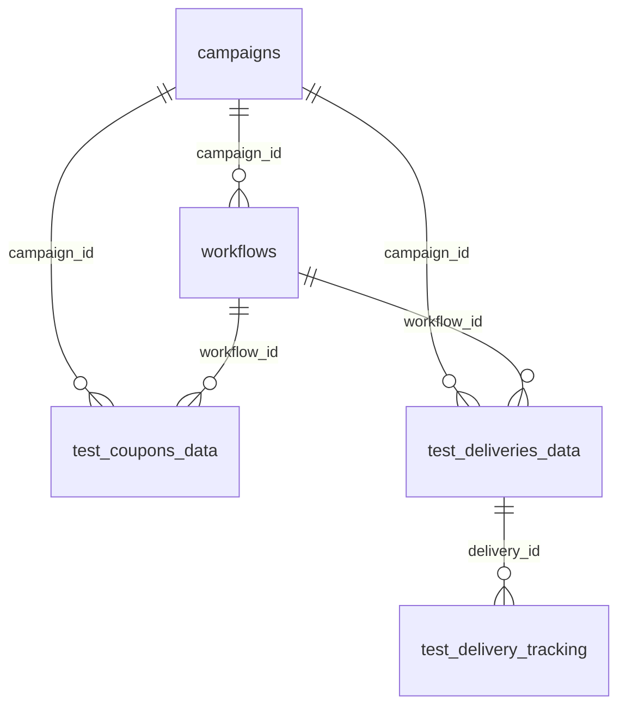

# 5개 테이블 관계도 (자동 추론)

## 관계 목록

| from_table | from_column | to_table | to_column | 추론방법 |
|------------|-------------|----------|-----------|----------|
| workflows | campaign_id | campaigns | id | pluralize |
| test_coupons_data | campaign_id | campaigns | id | pluralize |
| test_coupons_data | workflow_id | workflows | id | pluralize |
| test_deliveries_data | campaign_id | campaigns | id | pluralize |
| test_deliveries_data | workflow_id | workflows | id | pluralize |
| test_delivery_tracking | delivery_id | test_deliveries_data | id | extended(복수형⊂테이블명) |

## ASCII 관계도
```

  [campaigns]
       | campaign_id
       +---> [workflows]
       |         | workflow_id
       |         +---> [test_coupons_data]
       |         +---> [test_deliveries_data]
       |                   | delivery_id
       |                   +---> [test_delivery_tracking]
       +---> [test_coupons_data]
       +---> [test_deliveries_data]

```

## Mermaid ER 다이어그램
(아래 블록을 [Mermaid Live](https://mermaid.live) 또는 GitHub 마크다운에 붙여넣으면 시각화됩니다.)


